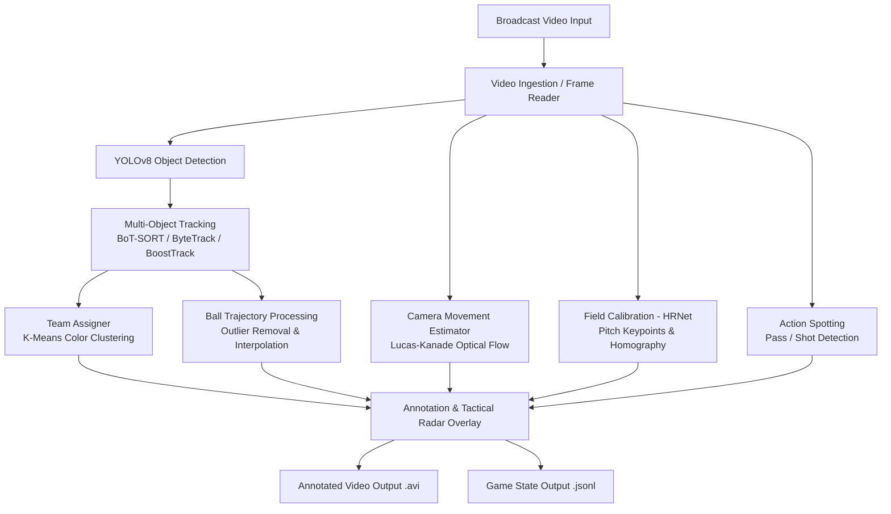

# Football AI Tracker & Tactical Video Analysis System

A comprehensive computer vision and deep learning framework for broadcast football (soccer) video analytics. The system integrates advanced computer vision techniques: object detection, multi-object tracking (MOT), jersey color clustering for automated team segregation, optical flow camera movement estimation, HRNet-based pitch keypoint calibration and 2D tactical radar projection (homography), action spotting, and structured game state serialization (GSR).

---

## Key Features

- **Object Detection & Multi-Object Tracking (MOT)**:
  - Custom fine-tuned **YOLOv8** model detecting players, goalkeepers, referees, and the ball.
  - Multi-tracker integration supporting **BoT-SORT**, **ByteTrack**, and **BoostTrack** (with ReID support) to maintain consistent identities through occlusions.
- **Automated Team Assignment & Jersey Color Clustering**:
  - Automatically crops player torso regions while excluding pitch grass and background clutter.
  - Employs **K-Means Clustering** in color space to segregate players into two distinct teams and assign corresponding team colors.
- **Ball Tracking & Trajectory Smoothing**:
  - Distance-based outlier rejection to filter false detections.
  - Linear interpolation across occluded frames combined with moving-average convolution filtering for continuous and smooth ball trajectory rendering.
- **Camera Movement Compensation**:
  - Computes frame-to-frame camera pan and tilt displacements ($dx, dy$) using **Lucas-Kanade Optical Flow** on perimeter image features.
  - Displays real-time camera motion vectors to decouple player movement from broadcast camera pans.
- **Field Calibration & 2D Tactical Radar (Pitch Homography)**:
  - Uses an **HRNet** model to detect pitch line intersections and keypoints.
  - Estimates the camera projection matrix and homography ($H$) to map image pixels to standard metric pitch coordinates.
  - Generates a real-time top-down 2D tactical radar (minimap) blended directly onto the video output.
- **Ball Action Spotting**:
  - Identifies key match events such as passes, ball drives, and shots.
  - Visualizes real-time action probabilities and event detections via dynamic temporal graph overlays.
- **Game State Representation (GSR)**:
  - Exports structured frame-by-frame data in `JSONL` format (`game_state.jsonl`) containing normalized coordinates, bounding boxes, object IDs, and team classifications for downstream analytics.

---

## System Architecture



---

## Project Structure

```text
football-detection/
├── main.py                       # Main pipeline integrating all analytics modules
├── yolo_inference.py             # Quick inference test script using standalone YOLO
├── booststracks.py               # BoostTrack integration module with ReID weights
├── gsr_adapter.py                # Game State Representation adapter exporting JSONL
├── HOWTORUN.md                   # Quick operational notes and references
│
├── trackers/                     # Object detection and tracking module
│   ├── tracker.py                # Tracker class: YOLOv8 + BoT-SORT/ByteTrack + ball trajectory
│   └── __init__.py
│
├── team_assigner/                # Automated team color assignment module
│   └── team_assigner.py          # K-Means clustering on player jersey crops
│
├── camera_movement_estimator/    # Camera pan/tilt compensation module
│   └── camera_movement_estimator.py # Lucas-Kanade optical flow estimator
│
├── FieldMarkings/                # Pitch calibration and 2D radar view
│   ├── run.py                    # Homography computation and 2D radar drawing
│   ├── baseline/                 # Camera unprojection and pitch geometry
│   └── src/                      # HRNet architecture and keypoint tools
│
├── BallAction/                   # Event and action spotting module
│   ├── Test_Visual.py            # Real-time action probability graph visualizer
│   ├── scripts/
│   └── src/
│
├── ball_tracker/                 # Streaming ball buffer and trajectory smoothing
│   └── ball_tracker.py
│
├── view_transformer/             # Pixel-to-pitch coordinate perspective transformation
│   └── view_transformer.py
│
├── utils/                        # Shared utility functions
│   ├── bbox_utils.py             # Bounding box measurements, foot positions, and centers
│   └── video_utils.py            # Optimized video I/O utilities using OpenCV
│
├── training/                     # Model training notebooks
│   └── football_training_yolo_v5.ipynb # Training pipeline for football entity detection
│
├── pyproject.toml                # Project metadata and dependencies for uv
├── uv.lock                       # Dependency lockfile
└── requirements.txt              # Standard Python dependencies
```

---

## Installation & Environment Setup

### 1. Prerequisites
- **Operating System**: Windows 10/11 or Linux
- **Python**: Version `>= 3.10`
- **Hardware**: NVIDIA GPU with CUDA support recommended (PyTorch with CUDA 11.8+).

---

### 2. Setting Up the Environment

Using **[uv](https://github.com/astral-sh/uv)** is recommended for fast and deterministic package resolution:

#### Option A: Using `uv` (Recommended)
```bash
# Install uv if not already installed
pip install uv

# Synchronize exact dependencies from uv.lock
uv pip sync

# Or synchronize directly from pyproject.toml
uv sync
```

#### Option B: Using `pip` and Virtual Environment
```bash
# Create virtual environment
python -m venv .venv

# Activate virtual environment
# On Windows:
.venv\Scripts\activate
# On Linux/macOS:
source .venv/bin/activate

# Install PyTorch with CUDA 11.8 support:
pip install torch torchvision --index-url https://download.pytorch.org/whl/cu118

# Install dependencies from requirements.txt:
pip install -r requirements.txt
```

---

## Data & Model Weights Setup

Before running `main.py`, create a `data/` directory with the following structure:

```text
football-detection/
└── data/
    ├── inputs/
    │   └── Testvideo.mp4           # Input football match video
    ├── outputs/                    # Output directory (generated automatically)
    └── models/
        ├── detect/
        │   └── best_ylv8_ep50.pt   # YOLOv8 weights for player, ball, and referee detection
        ├── HRNet_57_hrnet48x2_57_003/
        │   └── evalai-018-0.536880.pth # HRNet model weights for pitch calibration
        └── ball_action/
            └── test_raw_predictions.npz # Action spotting inference data
```

> **Note**: Model weights (`.pt`, `.pth`, `.npz`) and large media files are excluded from git tracking via `.gitignore`.

---

## Usage

### 1. Run the Full Analytics Pipeline
Execute the complete pipeline incorporating detection, tracking, team clustering, camera compensation, 2D tactical radar, and action spotting:

```bash
# Using uv:
uv run main.py

# Or using standard python:
python main.py
```

- **Video Output**: Saved to `data/outputs/TestVideo.avi` featuring:
  - Bounding ellipses with persistent track IDs and team colors.
  - Green ball trajectory trail with outlier filtering.
  - Camera movement vector indicator ($dx, dy$).
  - Blended 2D tactical pitch radar minimap.
  - Real-time action probability graphs.
- **Data Output**: Saved to `data/outputs/game_state.jsonl` with per-frame structured entity states.

---

### 2. Quick YOLO Inference Test
To test raw detection output on a video clip:

```bash
python yolo_inference.py
```

---

### 3. Model Training
To train or fine-tune detection models on custom football datasets:
- Open and run the notebooks in `training/` (e.g., `football_training_yolo_v5.ipynb` or `football_training_yolo_v5l_cl.ipynb`).
- Training checkpoints and validation logs are saved in `training/runs/detect/`.

---

## Configuration Options

- **Tracker Selection**:
  Switch between **BoT-SORT** and **ByteTrack** in `main.py`:
  ```python
  # Enable BoT-SORT (higher tracking stability):
  tracker = Tracker('data/models/detect/best_ylv8_ep50.pt', use_boost=True)

  # Enable ByteTrack (faster inference):
  tracker = Tracker('data/models/detect/best_ylv8_ep50.pt', use_boost=False)
  ```
- **Frame Limit**:
  For rapid testing, `main.py` includes a frame cutoff:
  ```python
  if frame_idx >= fps * 300:  # Processes the first 300 seconds
      break
  ```
  Remove or adjust this condition to process full-length matches.

---

## Tech Stack

| Component | Library / Framework |
| :--- | :--- |
| **Deep Learning** | PyTorch, Ultralytics YOLOv8, HRNet (Argus) |
| **Multi-Object Tracking** | BoT-SORT, Supervision (ByteTrack), BoxMOT (BoostTrack) |
| **Computer Vision** | OpenCV, Kornia, Pillow |
| **Data Processing & Clustering** | Scikit-learn (K-Means), SciPy, NumPy, Pandas |
| **Action Spotting** | SoccerNet Action Spotting baseline |
| **Package Management** | `uv`, pip, pyproject.toml |

---

## License & Contribution

This project is developed for sports analytics and computer vision research. Contributions, bug reports, and pull requests are welcome.